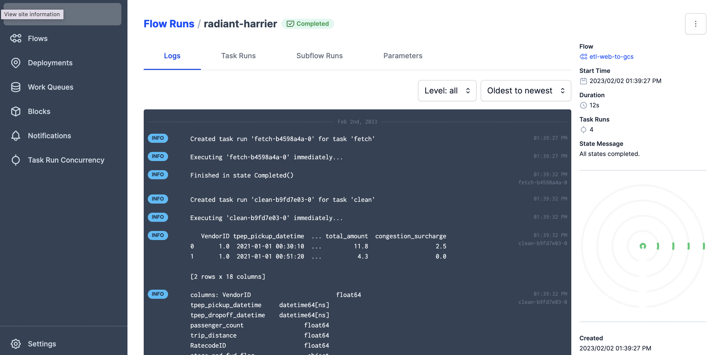

# Week 2 Notes

[Week 1 notes](https://teacherc.github.io/data-engineering/2023/01/18/zoomcamp1.html) are here if you need them.

- [What is a Data Lake?](#what-is-a-data-lake-)
- [What is Data Orchestration?](#what-is-data-orchestration-)
  * [Notes from sources I've found](#notes-from-sources-i-ve-found)
  * [Course video notes](#course-video-notes)
- [Introduction to Prefect](#introduction-to-prefect)
  * [Introduction to Prefect concepts](#introduction-to-prefect-concepts)
    + [Prepare virtual environment (on a virtual machine)](#prepare-virtual-environment--on-a-virtual-machine-)
    + [Running the initial ingestion script (without orchestration)](#running-the-initial-ingestion-script--without-orchestration-)
    + [How will orchestration be better?](#how-will-orchestration-be-better-)
    + [Integrating Prefect](#integrating-prefect)
    + [Testing our flow](#testing-our-flow)
    + [Breaking up the ingest function](#breaking-up-the-ingest-function)
    + [Parameterization and Subflows](#parameterization-and-subflows)
  * [Orion UI Tour](#orion-ui-tour)
  * [Overview of Blocks](#overview-of-blocks)
- [ETL with GCP and Prefect](#etl-with-gcp-and-prefect)
  * [Preparing our environment](#preparing-our-environment)
  * [Make a flow](#make-a-flow)
  * [Add a Transform task](#add-a-transform-task)
  * [Make a task to write to our local file system](#make-a-task-to-write-to-our-local-file-system)
  * [Make a task to write to GCS (part 1)](#make-a-task-to-write-to-gcs--part-1-)
  * [GCS overview](#gcs-overview)
  * [Prefect Blocks: GCS Bucket](#prefect-blocks--gcs-bucket)
  * [Prefect Blocks: GCS Credentials and Service Accounts](#prefect-blocks--gcs-credentials-and-service-accounts)
  * [Prefect Blocks: Write to GCS (part 2)](#prefect-blocks--write-to-gcs--part-2-)
- [GCS to Big Query](#gcs-to-big-query)
  * [00:22 Prefect Flow: GCS to BigQuery / 02:24 Prefect Task: Extract from GCS](#00-22-prefect-flow--gcs-to-bigquery---02-24-prefect-task--extract-from-gcs)
  * [08:33 Prefect Task: Data Transformation](#08-33-prefect-task--data-transformation)
  * [12:19 Prefect Task: Load into BigQuery - Part I  /  14:07 BigQuery: Overview & Data Import from GCS / 17:10 Prefect Task: Load into BigQuery - Part II](#12-19-prefect-task--load-into-bigquery---part-i-----14-07-bigquery--overview---data-import-from-gcs---17-10-prefect-task--load-into-bigquery---part-ii)
  * [20:13 BigQuery: Querying the Data](#20-13-bigquery--querying-the-data)
- [Next](#next)

<small><i><a href='http://ecotrust-canada.github.io/markdown-toc/'>Table of contents generated with markdown-toc</a></i></small>


## What is a Data Lake?

- A data lake allows us to gather vast amounts of unstructured data for later use
- A data warehouse is where structured data can be accessed
- An ETL (export, transform, load) typically applies to small amounts of data
    - This is a schema on write framework - data is structured as it is written to the data warehouse
- An ELT (export, load, and transform) is better for large amounts of data
    - This allows for use of a data lake
    - Schema on read is when data is structured as it is pulled out of a data lake (or read)
    - This is innovative because of the fact that data can become valuable right away (it can be loaded as-is and used when needed)
- Data lake "gotchas" include the lack of metadata and versioning, the propensity for the lake to become an unusuable swamp, and the inability to join data in the lake
- Cloud providers for data lakes:
    - Google Cloud Platform: Google Cloud Storage
    - AWS: S3
    - Microsoft Azure: Azure Blob

## What is Data Orchestration?

### Notes from sources I've found

[What is Data Orchestration?](https://www.youtube.com/watch?v=iyw9puEmTrA)

- The goal of data engineering is to turn data into useful information
- Just like a conductor helps a group of musicians play their instruments at the right pace and intensity, a data orchestrator helps us capture data from a variety of sources by coordinating multiple systems and manipulating settings (example: dialing compute resources up or down depending on where we are in the pipeline, turning microservices on and off, etc)
- Before the cloud, most data pipelines were run at night and all equipment would live in one data center
- Now, our systems are dispersed in the cloud, and we do not want to only have to ingest data at night

### Course video notes

- A data flow combines disparate applications together - these applications are often from many different vendors
- Examples of disparate applications and services:
    - A cleansing script in Pandas
    - Data transformation with DBT
    - ML use case
- A workflow orchestration tool allows us to turn code into a workflow that can be scheduled, run, and observed
- Workflow configurations include:
    - The order of execution (of tasks)
    - The packaging (Docker, Kubernetes, sub-process)
    - The type of delivery (concurrency, async, Ray, DAGs, etc)
- A workflow orchestration tool executes the workflow run
    - Scheduling
    - Remote execution
    - Privacy
    - Knows when to restart or retry an operation
    - Visibility / Alerts
    - Parametarization
    - Integrates with many systems
- Prefect is a modern, open source orchestration tool 

## Introduction to Prefect

### Introduction to Prefect concepts

#### Prepare virtual environment (on a virtual machine)

- Start your GCP VM instance and note the external IP
- Navigate to your ```~/.ssh``` folder and find the config file
- Edit the config file - replace the old ```HostName``` address with the new external IP and save the file
- Head to VS Code and start the ssh session (mine is called ```dezoomcamp```)
- Navigate to the [Prefect Code](https://github.com/discdiver/prefect-zoomcamp.git) for the DE Zoomcamp
- Click on the green ```Code``` button and copy the HTTPS URL
- In your VSCode ssh terminal, type ```git clone https://github.com/discdiver/prefect-zoomcamp.git``` (or the URL you found)
- Use ```open``` in VSCode to open the folder you've cloned
- Open this file in VSCode: ```/home/{user}]/prefect-zoomcamp/flows/01_start/ingest_data.py```
- Use Conda to create an virtual environment ```conda create -n zoomcamp python=3.9```
- Activate the environment you've just created. My example: ```conda activate zoomcamp```
- Navigate to the folder with the Prefect code in it and use pip to install the requirements ```pip install -r requirements.txt ```
- Double check the version of Prefect installed in your virtual environment with ```prefect version```
- - Make sure you have also cloned the [Zoomcamp repo](https://github.com/DataTalksClub/data-engineering-zoomcamp)
- Navigate to this data engineering zoomcamp folder
- Open a new terminal in your OS - Find the folder with the Dockerfile and yaml - run ```docker-compose up``` from that folder in the ssh terminal

docker-compose.yaml
```yaml
services:
  pgdatabase:
    image: postgres:13
    environment:
      - POSTGRES_USER=root
      - POSTGRES_PASSWORD=root
      - POSTGRES_DB=ny_taxi
    volumes:
      - "./ny_taxi_postgres_data:/var/lib/postgresql/data:rw"
    ports:
      - "5432:5432"
  pgadmin:
    image: dpage/pgadmin4
    environment:
      - PGADMIN_DEFAULT_EMAIL=admin@admin.com
      - PGADMIN_DEFAULT_PASSWORD=root
    ports:
      - "8080:80"
```

Dockerfile
```yaml
FROM python:3.9.1

RUN apt-get install wget
RUN pip install pandas sqlalchemy psycopg2

WORKDIR /app
COPY ingest_data.py ingest_data.py 

ENTRYPOINT [ "python", "ingest_data.py" ]
```

- Run ```docker ps```. Copy the name of the database container.
- Open pgadmin and log in. Add a server - paste the name of the database container for the server name. The username and password should both be ```root```
- In VSCode, forward the ports ```8080```, ```5432```, and ```8888```
- Using pgcli or pgadmin in the browser, drop your existing tables


#### Running the initial ingestion script (without orchestration)
- Modify ```ingest_data.py``` in the Prefect code (I had to change the username, password, and port)
```python
if __name__ == '__main__':
    user = "root"
    password = "root"
    host = "localhost"
    port = "5432"
    db = "ny_taxi"
    table_name = "yellow_taxi_trips"
    csv_url = "https://github.com/DataTalksClub/nyc-tlc-data/releases/download/yellow/yellow_tripdata_2021-01.csv.gz"

    ingest_data(user, password, host, port, db, table_name, csv_url)
```

- From the ```~/prefect-zoomcamp/flows/01_start``` folder in your VSCode terminal, run ```python ingest_data.py```
- Use pgcli or pgadmin to check the first 100 rows and count the number of rows (I had ```1_369_765``` rows)

#### How will orchestration be better?
- We won't have to manually handle dependencies and run the script when we need data ingestion to happen
- We'll have visibility about what does and does not happen

#### Integrating Prefect

Pre-reads: 
- To learn more about what decorators do in Python, watch this [Tech with Tim](https://www.youtube.com/watch?v=tfCz563ebsU) video. 
- If you are new to programming and need more information about objects in Python, watch this [CS Dojo](https://www.youtube.com/watch?v=wfcWRAxRVBA) clip.

- Add the Prefect imports in ```ingest_data.py```

```python
from prefect import flow, task
```
A ```flow``` is the most basic Python object in Prefect. It is a container of workflow logic that allow us to interact with flows as if they are functions (with inputs, outputs, etc).

We add ```flow``` logic to the ingestion script by using decorators.

First, we'll create a ```main()``` function with a Prefect flow decorator. Then, we'll tell Python to run this function when the program is initialized. All of the parameters that were established in ```if __name__ == '__main__':``` now exist in the ```main()``` function.

```python
@flow(name="Ingest Flow")
def main():
    user = "root"
    password = "root"
    host = "localhost"
    port = "5432"
    db = "ny_taxi"
    table_name = "yellow_taxi_trips"
    csv_url = "https://github.com/DataTalksClub/nyc-tlc-data/releases/download/yellow/yellow_tripdata_2021-01.csv.gz"

    ingest_data(user, password, host, port, db, table_name, csv_url)

if __name__ == '__main__':
    main()
```

Flows contain tasks. Now, we can turn the ```ingest_data()``` function into a task by adding the ```@task``` decorator.

```python
@task()
def ingest_data(user, password, host, port, db, table_name, url):
    
    # the backup files are gzipped, and it's important to keep the correct extension
    # for pandas to be able to open the file
    if url.endswith('.csv.gz'):
        csv_name = 'yellow_tripdata_2021-01.csv.gz'
    else:
        csv_name = 'output.csv'

    os.system(f"wget {url} -O {csv_name}")
    postgres_url = f'postgresql://{user}:{password}@{host}:{port}/{db}'
    engine = create_engine(postgres_url)

    df_iter = pd.read_csv(csv_name, iterator=True, chunksize=100000)

    df = next(df_iter)

    df.tpep_pickup_datetime = pd.to_datetime(df.tpep_pickup_datetime)
    df.tpep_dropoff_datetime = pd.to_datetime(df.tpep_dropoff_datetime)

    df.head(n=0).to_sql(name=table_name, con=engine, if_exists='replace')

    df.to_sql(name=table_name, con=engine, if_exists='append')


    while True: 

        try:
            t_start = time()
            
            df = next(df_iter)

            df.tpep_pickup_datetime = pd.to_datetime(df.tpep_pickup_datetime)
            df.tpep_dropoff_datetime = pd.to_datetime(df.tpep_dropoff_datetime)

            df.to_sql(name=table_name, con=engine, if_exists='append')

            t_end = time()

            print('inserted another chunk, took %.3f second' % (t_end - t_start))

        except StopIteration:
            print("Finished ingesting data into the postgres database")
            break
```

Tasks are not required for flows, but they are special because they can receive upstream metadata about the state of dependencies before the function is run. This means that the task can wait on the completion of another task.

We'll add arguments to our task decorator so logging and retries happen:

```python
@task(log_prints=True, retries=3)
```

We can clean up our code by taking out the print statements from the ```while True``` statement because of the logging we've added to the task. NOTE: I kept the ```while True``` statement because I want this flow to iterate over the entire csv (not just the first 100_000 rows). In the video, she eliminates ```while True``` entirely.

Our resulting ```ingest_data.py``` file looks like this:
```python
import os
import argparse
from time import time
import pandas as pd
from sqlalchemy import create_engine
from prefect import flow, task

@task(log_prints=True, retries=3)
def ingest_data(user, password, host, port, db, table_name, url):
    
    # the backup files are gzipped, and it's important to keep the correct extension
    # for pandas to be able to open the file
    if url.endswith('.csv.gz'):
        csv_name = 'yellow_tripdata_2021-01.csv.gz'
    else:
        csv_name = 'output.csv'

    os.system(f"wget {url} -O {csv_name}")
    postgres_url = f'postgresql://{user}:{password}@{host}:{port}/{db}'
    engine = create_engine(postgres_url)

    df_iter = pd.read_csv(csv_name, iterator=True, chunksize=100000)

    df = next(df_iter)

    df.tpep_pickup_datetime = pd.to_datetime(df.tpep_pickup_datetime)
    df.tpep_dropoff_datetime = pd.to_datetime(df.tpep_dropoff_datetime)

    df.head(n=0).to_sql(name=table_name, con=engine, if_exists='replace')

    df.to_sql(name=table_name, con=engine, if_exists='append')
    
    while True: 

        try:            
            df = next(df_iter)

            df.tpep_pickup_datetime = pd.to_datetime(df.tpep_pickup_datetime)
            df.tpep_dropoff_datetime = pd.to_datetime(df.tpep_dropoff_datetime)

            df.to_sql(name=table_name, con=engine, if_exists='append')

        except StopIteration:
            break


@flow(name="Ingest Flow")
def main():
    user = "root"
    password = "root"
    host = "localhost"
    port = "5432"
    db = "ny_taxi"
    table_name = "yellow_taxi_trips"
    csv_url = "https://github.com/DataTalksClub/nyc-tlc-data/releases/download/yellow/yellow_tripdata_2021-01.csv.gz"

    ingest_data(user, password, host, port, db, table_name, csv_url)

if __name__ == '__main__':
    main()
```

#### Testing our flow
- Use pgcli or pgadmin to drop any tables you've ingested ```DROP TABLE yellow_taxi_trips```
- Run ```python ingest_data.py```
- Run ```COUNT(*)``` in pgadmin to make sure the data was ingested properly
- Drop the table you've just ingested and delete the csv.gz file

#### Breaking up the ingest function
Changed ```ingest_data.py``` code
```python
#!/usr/bin/env python
# coding: utf-8
import os
import argparse
from time import time
import pandas as pd
from sqlalchemy import create_engine
from prefect import flow, task
from prefect.tasks import task_input_hash
from datetime import timedelta

@task(log_prints=True, retries=3, cache_key_fn=task_input_hash, cache_expiration=timedelta(days=1))
def extract_data(csv_url, user, password, host, port, db):
    if csv_url.endswith('.csv.gz'):
        csv_name = 'yellow_tripdata_2021-01.csv.gz'
    else:
        csv_name = 'output.csv'

    os.system(f"wget {csv_url} -O {csv_name}")
    postgres_url = f'postgresql://{user}:{password}@{host}:{port}/{db}'
    engine = create_engine(postgres_url)

    df_iter = pd.read_csv(csv_name, iterator=True, chunksize=100000)

    df = next(df_iter)

    df.tpep_pickup_datetime = pd.to_datetime(df.tpep_pickup_datetime)
    df.tpep_dropoff_datetime = pd.to_datetime(df.tpep_dropoff_datetime)
    
    return df 

@task(log_prints=True)
def transform_data(df):
    print(f"pre: missing passenger count: {df['passenger_count'].isin([0]).sum()}")
    df = df[df['passenger_count'] != 0]
    print(f"post: missing passenger count: {df['passenger_count'].isin([0]).sum()}")
    
    return df 

@task(log_prints=True, retries=3)
def ingest_data(user, password, host, port, db, table_name, df):
    
    postgres_url = f'postgresql://{user}:{password}@{host}:{port}/{db}'
    engine = create_engine(postgres_url)
    
    df.head(n=0).to_sql(name=table_name, con=engine, if_exists='replace')
    df.to_sql(name=table_name, con=engine, if_exists='append')
    

@flow(name="Ingest Flow")
def main():
    user = "root"
    password = "root"
    host = "localhost"
    port = "5432"
    db = "ny_taxi"
    table_name = "yellow_taxi_trips"
    csv_url = "https://github.com/DataTalksClub/nyc-tlc-data/releases/download/yellow/yellow_tripdata_2021-01.csv.gz"

    raw_data = extract_data(csv_url, user, password, host, port, db)
    df = transform_data(raw_data)
    ingest_data(user, password, host, port, db, table_name, df)

if __name__ == '__main__':
    main()
```

Notes
- Add ```task_input_hash``` and ```timedelta``` imports 
from datetime import timedelta```
- Pandas's ```.isin()``` function checks to see if a given value exists. To learn more about ```.isin()```, watch [this YouTube clip](https://youtu.be/xe6tPzXlINs?t=80). The ```.sum()``` function returns the sum of values over the requested axis ([Pandas documentation](https://pandas.pydata.org/docs/reference/api/pandas.DataFrame.sum.html). So, ```print({df['passenger_count'].isin([0]).sum()}"))``` tells the total sum of ```passenger_count``` values that do not exist.
- The ```cache_key_fn``` allows Prefects tasks to use the cached state and figure out if a task should be run again (see [Prefect documentation](https://docs.prefect.io/concepts/tasks/#caching) for more information)
- ```df = df[df['passenger_count'] != 0]``` - this line transforms the data (it uses Pandas to keep rows where the passenger count is not equal to zero)
- I took out the ```while``` loop

#### Parameterization and Subflows

Updated code for ```ingest_data.py```
```python
import os
import argparse
from time import time
import pandas as pd
from sqlalchemy import create_engine
from prefect import flow, task
from prefect.tasks import task_input_hash
from datetime import timedelta

@task(log_prints=True, retries=3, cache_key_fn=task_input_hash, cache_expiration=timedelta(days=1))
def extract_data(csv_url, user, password, host, port, db):
    # the backup files are gzipped, and it's important to keep the correct extension
    # for pandas to be able to open the file
    if csv_url.endswith('.csv.gz'):
        csv_name = 'yellow_tripdata_2021-01.csv.gz'
    else:
        csv_name = 'output.csv'

    os.system(f"wget {csv_url} -O {csv_name}")
    postgres_url = f'postgresql://{user}:{password}@{host}:{port}/{db}'
    engine = create_engine(postgres_url)

    df_iter = pd.read_csv(csv_name, iterator=True, chunksize=100000)

    df = next(df_iter)

    df.tpep_pickup_datetime = pd.to_datetime(df.tpep_pickup_datetime)
    df.tpep_dropoff_datetime = pd.to_datetime(df.tpep_dropoff_datetime)
    
    return df 

@task(log_prints=True)
def transform_data(df):
    print(f"pre: missing passenger count: {df['passenger_count'].isin([0]).sum()}")
    df = df[df['passenger_count'] != 0]
    print(f"post: missing passenger count: {df['passenger_count'].isin([0]).sum()}")
    
    return df 

@task(log_prints=True, retries=3)
def ingest_data(user, password, host, port, db, table_name, df):
    
    postgres_url = f'postgresql://{user}:{password}@{host}:{port}/{db}'
    engine = create_engine(postgres_url)
    
    df.head(n=0).to_sql(name=table_name, con=engine, if_exists='replace')

    df.to_sql(name=table_name, con=engine, if_exists='append')
    
@flow(name="Subflow", log_prints=True)
def log_subflow(table_name: str):
    print(f"Logging Subflow for: {table_name}")

@flow(name="Ingest Flow")
def main(table_name: str = "yellow_taxi_trips"):
    user = "root"
    password = "root"
    host = "localhost"
    port = "5432"
    db = "ny_taxi"
    csv_url = "https://github.com/DataTalksClub/nyc-tlc-data/releases/download/yellow/yellow_tripdata_2021-01.csv.gz"

    log_subflow(table_name)
    raw_data = extract_data(csv_url, user, password, host, port, db)
    df = transform_data(raw_data)
    ingest_data(user, password, host, port, db, table_name, df)

if __name__ == '__main__':
    main()
```

- Subflows are flow functions that are called from within another flow ([documentation](https://docs.prefect.io/concepts/flows/#composing-flows))
- We added a subflow function
- The ```table_name``` has been parameterized so it can be defined by a user as an argument

### Orion UI Tour

- Enter ```prefect orion start``` in a ssh terminal

```console
 ___ ___ ___ ___ ___ ___ _____    ___  ___ ___ ___  _  _
| _ \ _ \ __| __| __/ __|_   _|  / _ \| _ \_ _/ _ \| \| |
|  _/   / _|| _|| _| (__  | |   | (_) |   /| | (_) | .` |
|_| |_|_\___|_| |___\___| |_|    \___/|_|_\___\___/|_|\_|

Configure Prefect to communicate with the server with:

    prefect config set PREFECT_API_URL=http://127.0.0.1:4200/api

View the API reference documentation at http://127.0.0.1:4200/docs

Check out the dashboard at http://127.0.0.1:4200
```
- Forward the port in VSCode (in my case, port 4200)
- Open the UI in the browser
- Run the ```prefect config set``` command given when Orion starts (```prefect config set PREFECT_API_URL=http://127.0.0.1:4200/api``` in my case)

Orion UI in the browser


### Overview of Blocks
[Prefect's documentation](https://docs.prefect.io/concepts/blocks/) says it best: "Blocks are a primitive within Prefect that enable the storage of configuration and provide an interface for interacting with external systems. Blocks are useful for configuration that needs to be shared across flow runs and between flows."

- Block names are immutable (they cannot be changed) - this allows us to use them across our codebase
- Blocks can be used to manage configurations with services that are external to Prefect
- Prefect's collections are pip-installable packages with pre-made tests: https://docs.prefect.io/collections/catalog/
- For example, this is [Prefect's SQLAlchemy block](https://prefecthq.github.io/prefect-sqlalchemy/)
- We've already installed ```prefect-sqlalchemy``` via ```requirements.txt```
- Add the sqlalchemy connector (listed on Prefect's Blocks page)
    -  Give it a name
    - Use the ```SyncDriver``` called ```postgresql + psycopg2```
    - Populate the arguments with this information (note: yours might look a bit different depending on your ports and username/password):
        ```python
        user = "root"
        password = "root"
        host = "localhost"
        port = "5432"
        db = "ny_taxi"
        ```
    - Copy-paste the code snippet you get after you submit the information

Updated Prefect Block in ```ingest_data.py``` code
```python
import os
import argparse
from time import time
import pandas as pd
from sqlalchemy import create_engine
from prefect import flow, task
from prefect.tasks import task_input_hash
from datetime import timedelta
from prefect_sqlalchemy import SqlAlchemyConnector


@task(log_prints=True, tags=["extract"], cache_key_fn=task_input_hash, cache_expiration=timedelta(days=1))
def extract_data(url: str):
    if url.endswith('.csv.gz'):
        csv_name = 'yellow_tripdata_2021-01.csv.gz'
    else:
        csv_name = 'output.csv'
    
    os.system(f"wget {url} -O {csv_name}")

    df_iter = pd.read_csv(csv_name, iterator=True, chunksize=100000)

    df = next(df_iter)

    df.tpep_pickup_datetime = pd.to_datetime(df.tpep_pickup_datetime)
    df.tpep_dropoff_datetime = pd.to_datetime(df.tpep_dropoff_datetime)

    return df

@task(log_prints=True)
def transform_data(df):
    print(f"pre: missing passenger count: {df['passenger_count'].isin([0]).sum()}")
    df = df[df['passenger_count'] != 0]
    print(f"post: missing passenger count: {df['passenger_count'].isin([0]).sum()}")
    return df

@task(log_prints=True, retries=3)
def load_data(table_name, df):
    
    connection_block = SqlAlchemyConnector.load("postgres-connector")
    with connection_block.get_connection(begin=False) as engine:
        df.head(n=0).to_sql(name=table_name, con=engine, if_exists='replace')
        df.to_sql(name=table_name, con=engine, if_exists='append')

@flow(name="Subflow", log_prints=True)
def log_subflow(table_name: str):
    print(f"Logging Subflow for: {table_name}")

@flow(name="Ingest Data")
def main_flow(table_name: str):

    csv_url = "https://github.com/DataTalksClub/nyc-tlc-data/releases/download/yellow/yellow_tripdata_2021-01.csv.gz"
    log_subflow(table_name)
    raw_data = extract_data(csv_url)
    data = transform_data(raw_data)
    load_data(table_name, data)

if __name__ == '__main__':
    main_flow(table_name = "yellow_trips")
```
## ETL with GCP and Prefect

### Preparing our environment

- Make sure you are ssh'd into the GCP VM
- Open at least two ssh terminals in VSCode
- Use ```conda activate``` to activate your conda environment in each open terminal (mine is ```conda activate zoomcamp```)
- In one terminal, use ```prefect orion start``` to start the local Orion server
- You might need to run ```prefect config set PREFECT_API_URL=http://127.0.0.1:4200/api``` to help Prefect communicate with the Orion server
- In a browser, navigate to the link given by the Orion server (example: ```http://127.0.0.1:4200```). Make sure the port is being forwarded in VSCode.
- In the folder where you are working, make a new folder called ```02_gcp```. In that folder, create a file called ```etl_web_to_gcs.py```.

### Make a flow

- One main flow function will call other task functions
- This function will take the yellow taxi data from the web, clean it up (transform it), and then save it as a parquet file in our data lake in Google Cloud Storage (GCS)
- Add relevant imports

```python
from pathlib import Path
import pandas as pd
from prefect import flow, task
from prefect_gcp.cloud_storage import GcsBucket
```

- Make our flow

```python
from pathlib import Path
import pandas as pd
from prefect import flow, task
from prefect_gcp.cloud_storage import GcsBucket

@task(retries=3)
def fetch(dataset_url: str) -> pd.DataFrame:
    """Read taxi data from web into Pandas dataframe"""

    df = pd.read_csv(dataset_url)

    return df

@flow()
def etl_web_to_gcs() -> None:
    """This is the main ETL function"""
    color = "yellow"
    year = "2021"
    month = 1
    dataset_file = f"{color}_tripdata_{year}-{month:02}"
    dataset_url = f"https://github.com/DataTalksClub/nyc-tlc-data/releases/download/{color}/{dataset_file}.csv.gz" 

    df = fetch(dataset_url)

if __name__ == '__main__':
    etl_web_to_gcs()

```

Notes on the flow code:
- These are hardcoded now, but we will parameterize these arguments later
- The ```dataset_file``` is an fstring that comes from how filenames are used on the NY Taxi site
- The ```dataset_url``` is an fstring that creates the right URL to pull data
- Added a ```retries``` argument to the task function - this is useful when getting data from the web

Next steps:
- Run the flow with ```python etl_web_to_gcs.py```


### Add a Transform task

```python
from pathlib import Path
import pandas as pd
from prefect import flow, task
from prefect_gcp.cloud_storage import GcsBucket

@task()
def fetch(dataset_url: str) -> pd.DataFrame:
    """Read taxi data from web into Pandas dataframe"""

    df = pd.read_csv(dataset_url)

    return df

@task(log_prints=True)
def clean(df=pd.DataFrame) -> pd.DataFrame:
    """Fix dtype issues"""
    df["tpep_pickup_datetime"] = pd.to_datetime(df["tpep_pickup_datetime"])
    df["tpep_dropoff_datetime"] = pd.to_datetime(df["tpep_dropoff_datetime"])
    print(df.head(2))
    print(f"columns: {df.dtypes}")
    print(f"rows: {len(df)}")
    
    return df

@flow()
def etl_web_to_gcs() -> None:
    """This is the main ETL function"""
    color = "yellow"
    year = "2021"
    month = 1
    dataset_file = f"{color}_tripdata_{year}-{month:02}"
    dataset_url = f"https://github.com/DataTalksClub/nyc-tlc-data/releases/download/{color}/{dataset_file}.csv.gz" 

    df = fetch(dataset_url)
    df_clean = clean(df)

if __name__ == '__main__':
    etl_web_to_gcs()

```

Notes:
- Added the new ```clean``` task function to cast two columns as datetime and print the first two rows
- Called the task from the main flow function

### Make a task to write to our local file system

Add a write_local task
```python
from pathlib import Path
import pandas as pd
from prefect import flow, task
from prefect_gcp.cloud_storage import GcsBucket

@task()
def fetch(dataset_url: str) -> pd.DataFrame:
    """Read taxi data from web into Pandas dataframe"""

    df = pd.read_csv(dataset_url)

    return df

@task(log_prints=True)
def clean(df=pd.DataFrame) -> pd.DataFrame:
    """Fix dtype issues"""
    df["tpep_pickup_datetime"] = pd.to_datetime(df["tpep_pickup_datetime"])
    df["tpep_dropoff_datetime"] = pd.to_datetime(df["tpep_dropoff_datetime"])
    print(df.head(2))
    print(f"columns: {df.dtypes}")
    print(f"rows: {len(df)}")
    
    return df

@task()
def write_local(df: pd.DataFrame, color: str, dataset_file: str) -> Path:
    """Write DataFrame out locally as parquet file"""
    path = Path(f"data/{color}/{dataset_file}.parquet")
    df.to_parquet(path, compression="gzip")
    return path

@flow()
def etl_web_to_gcs() -> None:
    """This is the main ETL function"""
    color = "yellow"
    year = "2021"
    month = 1
    dataset_file = f"{color}_tripdata_{year}-{month:02}"
    dataset_url = f"https://github.com/DataTalksClub/nyc-tlc-data/releases/download/{color}/{dataset_file}.csv.gz" 

    df = fetch(dataset_url)
    df_clean = clean(df)
    path = write_local(df_clean, color, dataset_file)

if __name__ == '__main__':
    etl_web_to_gcs()

```

Notes
- The ```write_local``` task function returns a ```pathlib``` ```Path``` object
- Parquet files are more compact than csv or gz files
- You need to make a ```flows/02_gcp/data/yellow``` before you run the Python script

### Make a task to write to GCS (part 1)


### GCS overview

- Head to ```cloud.google.com```
- Make sure you've selected the project you've created for this course
- Navigate to Google Cloud Storage
- Click ```+ Create``` to make a new bucket
- Make a name (keep the rest of the default fields) and click create
- Note the name of your bucket (mine is ```first_prefect_bucket```)

### Prefect Blocks: GCS Bucket

- Head to the Prefect Orion UI in your browser
- Click on ```Blocks```
- Go to a ssh terminal and use ```prefect block register -m prefect_gcp``` to add additional GCP Blocks

```console
Successfully registered 6 blocks

┏━━━━━━━━━━━━━━━━━━━━━━━━━━━━━━━┓
┃ Registered Blocks             ┃
┡━━━━━━━━━━━━━━━━━━━━━━━━━━━━━━━┩
│ BigQuery Warehouse            │
│ GCP Cloud Run Job             │
│ GCP Credentials               │
│ GcpSecret                     │
│ GCS Bucket                    │
│ Vertex AI Custom Training Job │
└───────────────────────────────┘

 To configure the newly registered blocks, go to the Blocks page in the Prefect UI: 
http://127.0.0.1:4200/blocks/catalog
```

- Refresh your browser window
- Add a Block - select ```GCS Bucket```
- Make the Block Name anything you want (I went with ```zoom-gcs```)
- Under Bucket, add the name of your GCS bucket (mine is ```first_prefect_bucket```)
- Under GCP Credentials, click ADD

### Prefect Blocks: GCS Credentials and Service Accounts
- Block name - ```zoom-gcp-creds```
- In the GCP console, navigate to the IAM & Admin --> Service Accounts page
- Click ```+ Create Service Account```
- Name: ```zoom-de-service-acct```
- I would vary the service address a bit instead of using one that is the exact name
- Click next to add roles
- Add ```BigQuery Admin``` and ```Storage Admin``` (```Storage Admin``` is found under Google Cloud Storage)
- Click continue and done
- On the next page, find the new service account. Under actions, select ```Manage Keys```
- Click ```Add Key``` and ```Create New Key```
- Select JSON
- Save this file in a SECURE location (this file should not be uploaded to any GitHub repo - I use a secure file vault for keys)
- Open the file you've save with a text editor. Copy this text and paste it into the ```Service Account Info``` area of the credential Block creation page in Orion
- Click ```Create``` and it will take you back to the GCS Bucket Block creation page
- Select the credential you just created
- Click ```Create```
- Copy the snippet text on the next page
```python
from prefect_gcp.cloud_storage import GcsBucket
gcp_cloud_storage_bucket_block = GcsBucket.load("zoom-gcs")
```

### Prefect Blocks: Write to GCS (part 2)

Code changes - add a ```write_gcs``` task (learn more about methods in the [Prefect Docs](https://prefecthq.github.io/prefect-gcp/cloud_storage/))
```python
from pathlib import Path
import pandas as pd
from prefect import flow, task
from prefect_gcp.cloud_storage import GcsBucket

@task()
def fetch(dataset_url: str) -> pd.DataFrame:
    """Read taxi data from web into Pandas dataframe"""

    df = pd.read_csv(dataset_url)

    return df

@task(log_prints=True)
def clean(df=pd.DataFrame) -> pd.DataFrame:
    """Fix dtype issues"""
    df["tpep_pickup_datetime"] = pd.to_datetime(df["tpep_pickup_datetime"])
    df["tpep_dropoff_datetime"] = pd.to_datetime(df["tpep_dropoff_datetime"])
    print(df.head(2))
    print(f"columns: {df.dtypes}")
    print(f"rows: {len(df)}")
    
    return df

@task()
def write_local(df: pd.DataFrame, color: str, dataset_file: str) -> Path:
    """Write DataFrame out locally as parquet file"""
    path = Path(f"data/{color}/{dataset_file}.parquet")
    df.to_parquet(path, compression="gzip")
    return path

@task()
def write_gcs(path: Path) -> None:
    """Upload local parquet file to GCS"""
    gcs_block = GcsBucket.load("zoom-gcs")
    gcs_block.upload_from_path(from_path=path, to_path=path)
    return

@flow()
def etl_web_to_gcs() -> None:
    """This is the main ETL function"""
    color = "yellow"
    year = "2021"
    month = 1
    dataset_file = f"{color}_tripdata_{year}-{month:02}"
    dataset_url = f"https://github.com/DataTalksClub/nyc-tlc-data/releases/download/{color}/{dataset_file}.csv.gz" 

    df = fetch(dataset_url)
    df_clean = clean(df)
    path = write_local(df_clean, color, dataset_file)
    write_gcs(path)

if __name__ == '__main__':
    etl_web_to_gcs()

```

- Run this code in the ssh terminal
- Head to Orion and check out the flow run logs

- You should also be able to navigate to the parquet file in the GCS Bucket


## GCS to Big Query

### 00:22 Prefect Flow: GCS to BigQuery / 02:24 Prefect Task: Extract from GCS

add imports and main ETL flow
```python
from pathlib import Path
import pandas as pd
from prefect import flow, task
from prefect_gcp.cloud_storage import GcsBucket
from prefect_gcp import GcpCredentials

@task(retries=3)
def extract_from_gcs(color: str, year: int, month: int) -> Path:
    """Download trip data from GCS"""
    gcs_path = f"data/{color}/{color}_tripdata_{year}-{month:02}.parquet"
    gcs_block = GcsBucket.load("zoom-gcs")
    gcs_block.get_directory(from_path=gcs_path, local_path=f"../data/")
    
    return Path(f"../data/{gcs_path}")


@flow()
def etl_gcs_to_bq():
    """Main ETL flow to load data into Big Query"""
    color = "yellow"
    year = 2021
    month = 1

    path = extract_from_gcs(color, year, month)

if __name__ == "__main__":
    etl_gcs_to_bq()
```

Notes
- We have a function to extract data from the data lake because this mirrors a data lake best practice - giving people in an organization a way to access data
- Breaking up the flow into pieces allows for people to use what they need
- The ```gcs_path``` reflects the organization of the GCS Bucket (we can check this in the Console UI)
- We're using ```.get_directory``` and ```GCSBucket.load``` methods from the GCS Block
    - This argument ```local_path=f"../data/"``` takes us up a level into the data folder
- When you run this code, you should see the parquet file in the VM file structure in the right location

### 08:33 Prefect Task: Data Transformation

```python
from pathlib import Path
import pandas as pd
from prefect import flow, task
from prefect_gcp.cloud_storage import GcsBucket
from prefect_gcp import GcpCredentials

@task(retries=3)
def extract_from_gcs(color: str, year: int, month: int) -> Path:
    """Download trip data from GCS"""
    gcs_path = f"data/{color}/{color}_tripdata_{year}-{month:02}.parquet"
    gcs_block = GcsBucket.load("zoom-gcs")
    gcs_block.get_directory(from_path=gcs_path, local_path=f"../data/")
    
    return Path(f"../data/{gcs_path}")

@task()
def transform(path: Path) -> pd.DataFrame:
    """Data cleaning example"""
    df = pd.read_parquet(path)
    print(f"pre: missing passenger count: {df['passenger_count'].isna().sum()}")
    df["passenger_count"].fillna(0, inplace=True)
    print(f"post: missing passenger count: {df['passenger_count'].isna().sum()}")
    
    return df


@flow()
def etl_gcs_to_bq():
    """Main ETL flow to load data into Big Query"""
    color = "yellow"
    year = 2021
    month = 1

    path = extract_from_gcs(color, year, month)
    df = transform(path)

if __name__ == "__main__":
    etl_gcs_to_bq()
```
Notes
- [Pandas .isna documentation](https://pandas.pydata.org/docs/reference/api/pandas.DataFrame.isna.html)
- [Pandas .fillna documentation](https://pandas.pydata.org/docs/reference/api/pandas.DataFrame.fillna.html)
- We use ```.fillna``` to fill N/A passenger counts with zeroes - we are making the assumption that if it has the value N/A, then someone forgot to put 0

### 12:19 Prefect Task: Load into BigQuery - Part I  /  14:07 BigQuery: Overview & Data Import from GCS / 17:10 Prefect Task: Load into BigQuery - Part II

```python
from pathlib import Path
import pandas as pd
from prefect import flow, task
from prefect_gcp.cloud_storage import GcsBucket
from prefect_gcp import GcpCredentials


@task(retries=3)
def extract_from_gcs(color: str, year: int, month: int) -> Path:
    """Download trip data from GCS"""
    gcs_path = f"data/{color}/{color}_tripdata_{year}-{month:02}.parquet"
    gcs_block = GcsBucket.load("zoom-gcs")
    gcs_block.get_directory(from_path=gcs_path, local_path=f"../data/")
    return Path(f"../data/{gcs_path}")


@task()
def transform(path: Path) -> pd.DataFrame:
    """Data cleaning example"""
    df = pd.read_parquet(path)
    print(f"pre: missing passenger count: {df['passenger_count'].isna().sum()}")
    df["passenger_count"].fillna(0, inplace=True)
    print(f"post: missing passenger count: {df['passenger_count'].isna().sum()}")
    return df

@task()
def write_bq(df: pd.DataFrame) -> None:
    """Write DataFrame to BiqQuery"""

    gcp_credentials_block = GcpCredentials.load("zoom-gcp-creds")

    df.to_gbq(
        destination_table="dezoomcamp.rides",
        project_id="neural-caldron-375619",
        credentials=gcp_credentials_block.get_credentials_from_service_account(),
        chunksize=500_000,
        if_exists="append",
    )

@flow()
def etl_gcs_to_bq():
    """Main ETL flow to load data into Big Query"""
    color = "yellow"
    year = 2021
    month = 1

    path = extract_from_gcs(color, year, month)
    df = transform(path)
    write_bq(df)


if __name__ == "__main__":
    etl_gcs_to_bq()

```

Notes
- [Pandas df.to_gbq documentation](https://pandas.pydata.org/docs/reference/api/pandas.DataFrame.to_gbq.html)
- To load data from GCS to GBQ, we can use the GUI in the console. Search for "Big Query", add data, and select GCS as the source. Fill out the mandatory fields in the GUI. 
    - The data we loaded is visible in Big Query (rides table)


    - Click on ```query in a new tab``` to check out the data. Then, delete it with this query: ```DELETE FROM `NAME_OF_PROJ.rides` WHERE true; ```
- Now, we'll simulate loading with the Prefect script
- After we use the Prefect script, we can check the run in Orion and in Big Query


### 20:13 BigQuery: Querying the Data

Run these queries in GBQ to make sure the data was ingested properly

```SELECT COUNT(*) FROM `PROJECT_NAME.dezoomcamp.rides` ```

```SELECT * FROM `PROJECT_NAME.dezoomcamp.rides` LIMIT 1000```

## Next
- Parametrizing Flow and Deployments
- Schedules & Docker Storage with Infrastructure
- Prefect Cloud and Additional Resources