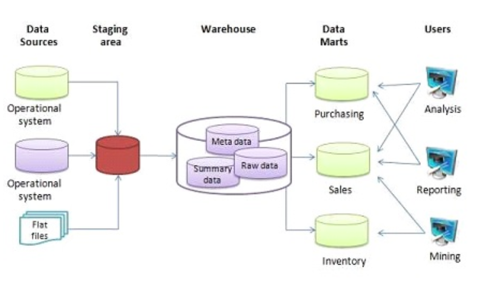
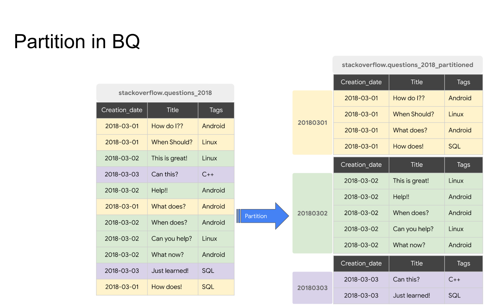
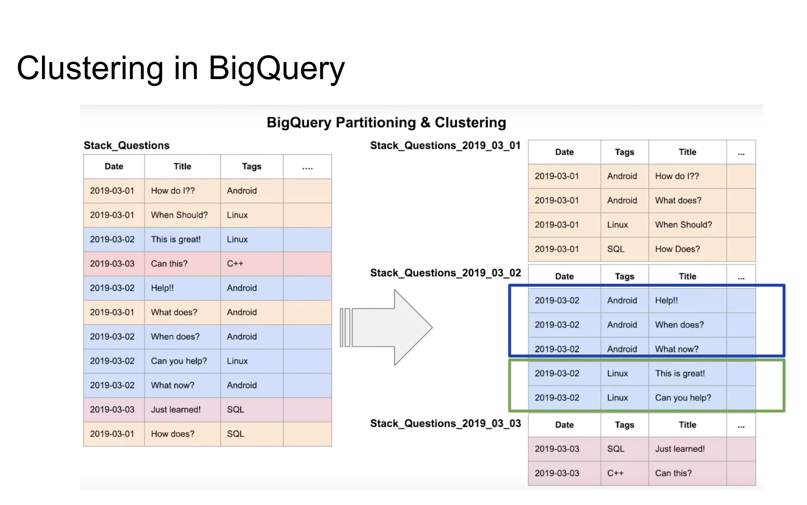

# Week 3 Notes

## Data Warehouse
### Data Warehouse and BigQuery

#### 00:28 OLAP vs OLTP

|   | OLTP | OLAP |
|---|---|---|
| Full name | Online Transaction Processing | Online Analytical Processing  |
| Purpose | Control and run essentail business ops in real-time | Plan, solve problems, support decisions, discover hidden insights  |
| Data Updates  |  Short, fast, initiated by user | Data is periodically refreshed with scheduled, long-running batch jobs  |
| Database Design | Normalized db's for efficiency  | Denormalized db's for analysis  |
| Space Requirements | Generally small if historical data is archived  | Generally large due to aggegating large datasets  |
| Backup and Recovery | Regular backups required for continuity, legal and governance requirements  | Lost data can be reloaded from OLTP databases as needed in lieu of regular backups  |
| Productivity | Increases productivity of end-users  | Increases productivity of business managers, data analysts, and executives  |
| Data view | Lists day-to-day business transactions  | Multi-dimensional view of enterprise data  |
| User examples | Customer-facing personnel, clerks, online shoppers  | Knowledge workers such as data analysts, business analysts, and executives  |

#### 02:18 What is a data warehouse

- A data warehouse is an OLAP solution used for reporting and data analysis



#### 03:36 BigQuery
- Serverless
- Scalable, highly-available infrastructure and software
- Built-in features related to machine learning, business intelligence, and geospatial analysis
- Maximizes flexibility by separating the compute engine from data storage

#### 05:19 BigQuery interface
- Clean interface
- Projects --> datasets

#### 07:04 Querying public datasets
- Public datasets are searchable inside of BQ

```SQL
-- Query public available table
SELECT station_id, name FROM
    bigquery-public-data.new_york_citibike.citibike_stations
LIMIT 100;
```

#### 07:42 BigQuery costs
- On-demand: 1 TB = $5
- Flat-rate:
    - Pre-requested slots
    - 100 slots = $2,000 per month = 400 TB

#### 09:02 Create an external table
From [Google Cloud's Documentation](https://cloud.google.com/bigquery/docs/external-tables):

"This page introduces external tables and provides guidance on querying data stored outside of BigQuery.

Non-BigLake external tables let you to query structured data in external data stores. To query a non-BigLake external table, you must have permissions to both the external table and the external data source.

You can use non-BigLake external tables with the following data stores:

Cloud Bigtable
Cloud Storage
Google Drive"

Note: When you use an external data source, BQ can't tell you the cost of each operation because the data isn't resting in BQ. 

```SQL
-- Creating external table referring to gcs path
CREATE OR REPLACE EXTERNAL TABLE `taxi-rides-ny.nytaxi.external_yellow_tripdata`
OPTIONS (
  format = 'CSV',
  uris = ['gs://nyc-tl-data/trip data/yellow_tripdata_2019-*.csv', 'gs://nyc-tl-data/trip data/yellow_tripdata_2020-*.csv']
);
```

```SQL
-- Check yellow trip data
SELECT * FROM taxi-rides-ny.nytaxi.external_yellow_tripdata limit 10;
```

#### 12:04 Partitioning
[Google Cloud Documentation - Partitions](https://cloud.google.com/bigquery/docs/partitioned-tables)

Notes: 
- Partitions are like filters. In the above example, the table is partitioned by creation date.
- Partitioning increases the performance of BigQuery (it will not read and process data that is not specified - reduces cost and time of processing).
- When you have BQ partition information, it can tell you the size and number of rows (unlike before when it couldn't tell us the number of rows or size in MB/GB/TB)
- The partitioned vs. non-partitioned tables have different icons in BQ

```SQL
-- Create a non partitioned table from external table
CREATE OR REPLACE TABLE taxi-rides-ny.nytaxi.yellow_tripdata_non_partitoned AS
SELECT * FROM taxi-rides-ny.nytaxi.external_yellow_tripdata;


-- Create a partitioned table from external table
CREATE OR REPLACE TABLE taxi-rides-ny.nytaxi.yellow_tripdata_partitoned
PARTITION BY
  DATE(tpep_pickup_datetime) AS
SELECT * FROM taxi-rides-ny.nytaxi.external_yellow_tripdata;
```

Impact of partition
```SQL
-- Impact of partition
-- Scanning 1.6GB of data
SELECT DISTINCT(VendorID)
FROM taxi-rides-ny.nytaxi.yellow_tripdata_non_partitoned
WHERE DATE(tpep_pickup_datetime) BETWEEN '2019-06-01' AND '2019-06-30';

-- Scanning ~106 MB of DATA
SELECT DISTINCT(VendorID)
FROM taxi-rides-ny.nytaxi.yellow_tripdata_partitoned
WHERE DATE(tpep_pickup_datetime) BETWEEN '2019-06-01' AND '2019-06-30';

-- Let's look into the partitons
SELECT table_name, partition_id, total_rows
FROM `nytaxi.INFORMATION_SCHEMA.PARTITIONS`
WHERE table_name = 'yellow_tripdata_partitoned'
ORDER BY total_rows DESC;

-- Query scans 1.1 GB
SELECT count(*) as trips
FROM taxi-rides-ny.nytaxi.yellow_tripdata_partitoned
WHERE DATE(tpep_pickup_datetime) BETWEEN '2019-06-01' AND '2020-12-31'
  AND VendorID=1;
```

#### 18:45 Clustering


Notes:
- Clustering is grouping by a category (ex: by operating system)
- This improves cost and query performance
- Choose cluster categories based on your use-case

```SQL
-- Creating a partition and cluster table
CREATE OR REPLACE TABLE taxi-rides-ny.nytaxi.yellow_tripdata_partitoned_clustered
PARTITION BY DATE(tpep_pickup_datetime)
CLUSTER BY VendorID AS
SELECT * FROM taxi-rides-ny.nytaxi.external_yellow_tripdata;

-- Query scans 864.5 MB
SELECT count(*) as trips
FROM taxi-rides-ny.nytaxi.yellow_tripdata_partitoned_clustered
WHERE DATE(tpep_pickup_datetime) BETWEEN '2019-06-01' AND '2020-12-31'
  AND VendorID=1;
```

## Partitoning and Clustering

### 00:12 BigQuery partition

Notes:

- Choices:
    - Time-unit column
    - Integar range partitioning
    - Ingestion time unit (_PARTITIONTIME) (Daily (default), hourly, monthly, or yearly)
- The max number of partitions is 4000

### 01:36 BigQuery clustering

- You can co-locate related data by specifying columns (max four)
- Order matters (determines the sorting)
- Clustering improves filter queries and aggregate queries
- Table with data size < 1 GB, don’t show significant improvement with partitioning and clustering
- Clustering columns must be top-level, non-repeated columns:
    - DATE
    - BOOL
    - GEOGRAPHY
    - INT64
    - NUMERIC
    - BIGNUMERIC
    - STRING
    - TIMESTAMP
    - DATETIME

### 03:13 Partitioning vs Clustering

| Clustering | Partitioning  |
|---|---|
| Cost benefit unknown |  Cost known upfront | 
|  You need more granularity than partitioning alone allows |  You need partition-level management |
|  Your queries commonly use filters or aggregation against multiple particular columns | Filter or aggregate on single column  |
| The cardinality of the number of values in a column or group of columns is large
  |   |


### 04:59 Clustering over partitioning

- Partitioning results in a small amount of data per partition (approximately less than 1 GB)
- Partitioning results in a large number of partitions beyond the limits on partitioned tables
- Partitioning results in your mutation operations modifying the majority of partitions in the table frequently (for example, every few minutes)

### 06:02 Automatic reclustering

As data is added to a clustered table:
- The newly inserted data can be written to blocks that contain key ranges that overlap with the key ranges in previously written blocks
- These overlapping keys weaken the sort property of the table

To maintain the performance characteristics of a clustered table
- BigQuery performs automatic re-clustering in the background to restore the sort property of the table
- For partitioned tables, clustering is maintained for data within the scope of each partition.


## Best Practices

Cost reduction:
- Avoid SELECT *
- Price your queries before running them
- Use clustered or partitioned tables
- Use streaming inserts with caution
- Materialize query results in stages

Query performance:
- Filter on partitioned columns
- Denormalizing data
- Use nested or repeated columns
- Use external data sources appropriately
- Don't use it, in case u want a high query performance
- Reduce data before using a JOIN
- Do not treat WITH clauses as prepared statements
- Avoid oversharding tables
- Avoid JavaScript user-defined functions
- Use approximate aggregation functions (HyperLogLog++)
- Order Last, for query operations to maximize performance
- Optimize your join patterns
    - As a best practice, place the table with the largest number of rows first, followed by the table with the fewest rows, and then place the remaining tables by decreasing size.

